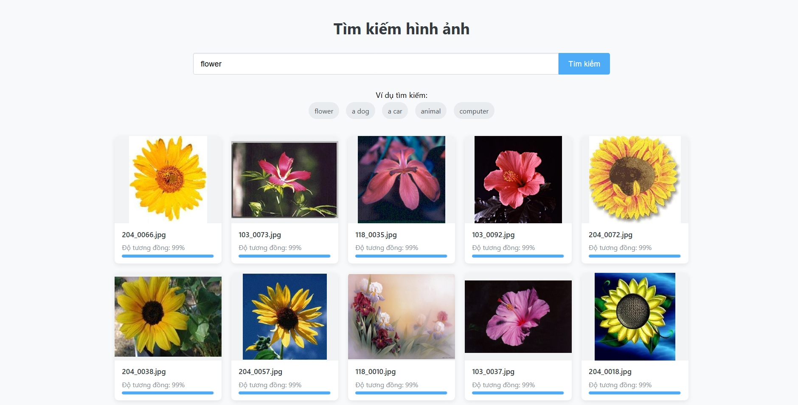

# Image Search System using ChromaDB and OpenCLIP

A simple image search engine where users can input text queries to retrieve similar images using ChromaDB and OpenCLIP embeddings. Built with Flask (backend) and plain HTML/JS (frontend).

---

## Project Structure
```
.
├── app.py              # Flask backend
├── load_images.py      # Script to load and embed images
├── images/             # Folder to store image dataset
├── templates/
│ └── frontend.html     # Simple frontend UI
└── README.md           # Project documentation

```

## Usage Instructions

1. Add Images to the System Use 
- Place your images inside the `images/` folder.
- Then run: ```python load_images.py```

2. Run the Application:
- Start the Flask backend server: ```python app.py```
- Open your browser and go to: http://127.0.0.1:5000/


## Sample Screenshot

